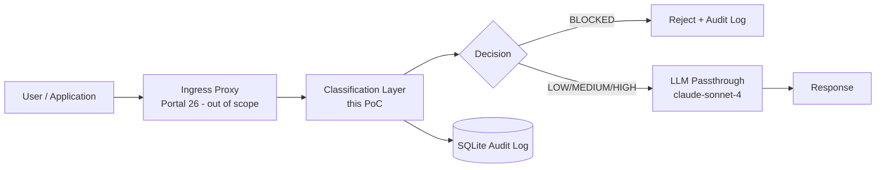

# AI Prompt DLP Analyzer

A data loss prevention layer for AI prompts. Classifies inputs for sensitive content before allowing passthrough to an LLM, logs every submission, and surfaces an audit dashboard.

## Architecture



**This PoC is the classification layer.** It is not a proxy. It is the governance brain that a proxy, browser extension, or API gateway calls to decide whether a prompt should reach an LLM.

## What this is

- Regex-based credential detection (12+ patterns: AWS, GitHub, Slack, JWT, PEM keys, DB connection strings)
- PII detection (email, phone, SSN, DOB) with Luhn validation for credit cards
- Business term classification via a configurable YAML list
- Base64 decode pass for obfuscated credentials (one level, non-recursive)
- Four-tier risk system: LOW / MEDIUM / HIGH / BLOCKED
- Three escalation rules: 2+ MEDIUM -> HIGH, 10+ LOW -> MEDIUM, 25+ combined -> HIGH
- Streamlit UI with Analyzer, Dashboard, and Settings pages
- SQLite audit log with CSV export
- Gated Claude passthrough with governance metadata header

## What this is not

- A proxy (use Portal 26 or Nginx for that)
- A semantic DLP tool (no NLP model, no cosine similarity)
- Production-hardened (SQLite resets on redeploy; see `docs/architecture.md` for the production path)

## Measured accuracy (30 labeled fixtures)

| Metric | Value |
|--------|-------|
| True Positives | 15 / 15 |
| True Negatives | 15 / 15 |
| False Positives | 0 |
| False Negatives | 0 |
| Precision | 1.00 |
| Recall | 1.00 |
| F1 | 1.00 |

Run `python tests/eval.py` to reproduce.

## Known limitations

- Obfuscation beyond base64 (hex encoding, Unicode escapes, homoglyph substitution) is not detected.
- Semantic confidential info without trigger terms ("the big deal" instead of "acquisition target") passes through.
- Multilingual inputs are not tested; regex patterns are ASCII-biased.
- Novel credential formats not in `config/patterns.yaml` are missed.
- Input cap is 50k characters.

## Setup

```bash
python -m venv .venv
source .venv/bin/activate   # Windows: .venv\Scripts\activate
pip install -r requirements.txt
```

Create `.streamlit/secrets.toml`:

```toml
ANTHROPIC_API_KEY = "sk-ant-..."
```

Run:

```bash
streamlit run app.py
```

## Deploy to Streamlit Cloud

1. Push repo to GitHub.
2. Connect repo in Streamlit Cloud. Set main file to `app.py`.
3. Add `ANTHROPIC_API_KEY` in the Secrets UI.
4. Deploy. SQLite DB is created on first run. Note: DB is wiped on redeploy. Production path: Supabase / Postgres.

## Run tests

```bash
pytest tests/test_classifier.py -v
python tests/eval.py
```

## File structure

```
app.py                  Streamlit entrypoint
classifier/             Detection engine
  engine.py             Tier resolution, escalation, Luhn
  patterns.py           YAML loader, compiled regex registry
  redactor.py           Partial-mask redaction
  decoder.py            Base64 pre-classification pass
db/
  logger.py             SQLite init, insert, query helpers
  schema.sql            DDL with WAL pragma and indices
llm/
  claude_client.py      Gated passthrough with cache_control system prompt
ui/
  analyzer.py           Input + results + passthrough button
  dashboard.py          KPIs, charts, table, CSV export
  settings.py           Category toggles, business terms, clear logs
config/
  patterns.yaml         Regex pattern registry
  business_terms.yaml   Confidential keyword list
  tiers.yaml            Precedence and escalation rules
tests/
  test_classifier.py    44 unit tests
  eval.py               Precision/recall runner
  fixtures/             30 labeled inputs (15 positive, 15 negative)
docs/
  comparison.md         vs Presidio, Comprehend, Nightfall, Portal 26
  architecture.md       Production architecture sketch
demos/
  inputs.md             7 scripted demo prompts with expected outcomes
```
